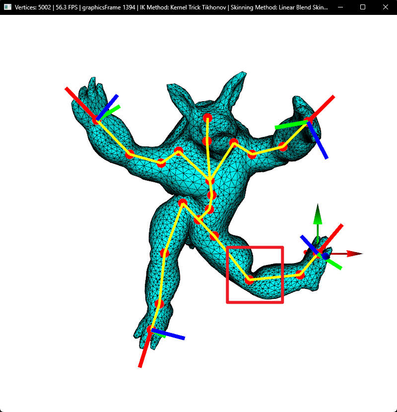
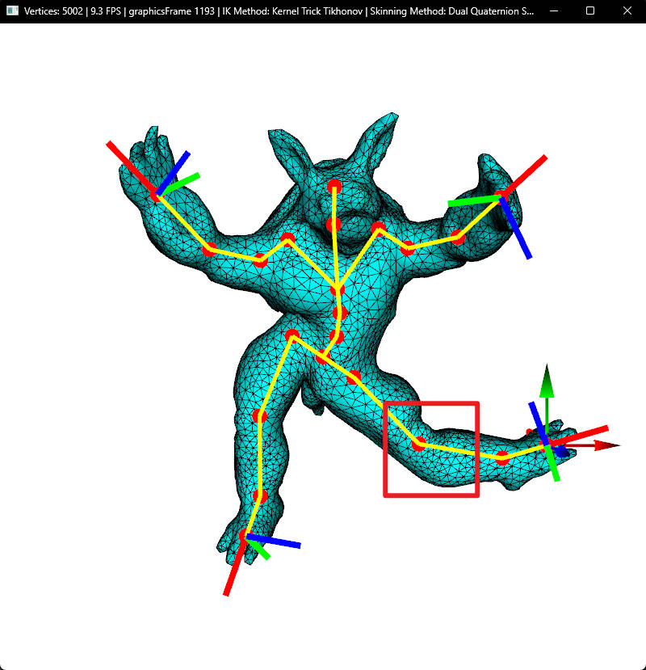

# Inverse Kinematics with Skinning

## Overview
This project implements skinning, forward kinematics (FK), and inverse kinematics (IK) to deform a character mesh based on a given skeleton structure. 
The character mesh is represented as an `.obj` file, and skinning weights and skeleton data are provided as ASCII files.
The implementation was done in C++, leveraging Eigen for linear algebra, ADOL-C for automatic differentiation, and OpenGL for rendering.
The project includes several methods for skinning and IK, and features a motion capture prototype using MediaPipe-based hand tracking.

|                      Skinning Demo                      |                     Motion Capture Prototype                     |
|:-------------------------------------------------------:|:----------------------------------------------------------------:|
|  |  |

## Functionalities

### Core Accomplishments

1. Implemented Forward Kinematics (FK) for computing joint global transformations.
2. Implemented Inverse Kinematics (IK) using the Tikhonov regularization method (aka. Damped least square method).
3. Integrated Linear Blend Skinning (LBS) for mesh deformation.

### Additional Features

1. **Implemented Dual-Quaternion Skinning (DQS) and provided a comparison between Linear Blend Skinning (LBS) and Dual Quaternion Skinning (DQS).**

    |                 |             Linear Blend Skinning             |           Dual-Quaternion Skinning            |
    |:---------------:|:---------------------------------------------:|:---------------------------------------------:|
    | Skinning Result |  |           | 
    | FPS             |                     56.3                      |                      9.3                      |

    As shown above, at some extreme poses (especially in areas with twisting joints), Linear Blend Skinning may cause _Candy Wrapper_ problem (shown in red box), while Dual-Quaternion Skinning (DQS) significantly mitigates it.
    DQS uses dual quaternions to represent transformations, which provides a more accurate interpolation of rotations and translations. This method leads to a more natural deformation of the mesh and significantly reduces the Candy Wrapper problem.
    However, performing LBS is much faster than DQS, and that's the reason why LBS is still very popular. 
    > Also note that smaller regulation coefficients of Tikhonov IK method are more likely to produce _Candy Wrapper_ problems. For above result, I temporarily set regulation coefficients to `0.0001`.

2. **Implemented Pseudo Inverse IK method and compared it with the Tikhonov IK method.**

    The change in pose $\triangle \mathbf{\theta}$ can be calculated in Pseudo Inverse IK method by:
    $$\triangle \mathbf{\theta} = \mathbf{J}^{\dagger} \triangle \mathbf{p}$$
    where, $\mathbf{J}^{\dagger} = \mathbf{J}^T (\mathbf{J} \mathbf{J}^T)^{-1}$ is the pseudo inverse of $\mathbf{J}$.
    Although Pseudo Inverse IK method calculates faster than Tikhonov IK method, Pseudo Inverse IK method tends to be unstable for large deformation.

    | Pseudo Inverse                            |            Tikhonov Regulation            |
    |:-----------------------------------------:|:-----------------------------------------:|
    |  |  |

3. **Implemented Tikhonov IK method with kernel trick and provided a comparison.**

    To solve the linear system of naive Tikhonov IK, the standard procedure is to compute:
    $$\triangle \mathbf{\theta} = (\mathbf{J}^T \mathbf{J} + \alpha \mathbf{I})^{-1} \mathbf{J}^T \triangle \mathbf{p}$$
    However, it can be proved that:
    $$\triangle \mathbf{\theta} = (\mathbf{J}^T \mathbf{J} + \alpha I)^{-1} \mathbf{J}^T \triangle \mathbf{p} = \mathbf{J}^T (\mathbf{J} \mathbf{J}^T + \alpha \mathbf{I})^{-1} \triangle \mathbf{p}$$
    Here, $\triangle \mathbf{\theta} \in \mathbb{R}^{in \times 1}$, $\triangle \mathbf{p} \in \mathbb{R}^{out \times 1}$, $\mathbf{J} \in \mathbb{R}^{out \times in}$, $\alpha \in \mathbb{R}$.
    Generally, the Forward Kinematics input dimension `in` is greater than the Forward Kinematics output dimension `out`, therefore it reduce the computation from perspective of matrix multiplication.
    This is also known as *kernel trick*.

    Here's my comparison of Tikhonov IK method w/ and w/o kernel trick:

    | Model     | w/ kernel trick | Skinning method | FK Input Dimension | FK Output Dimension |    FPS    |
    |:---------------:|:---------------:|:------------------:|:-------------------:|:---------:|:---------:|
    | armadillo |        √        |       DQS       |         66         |         12          |  **8.9**  |
    | armadillo |                 |       DQS       |         66         |         12          |    8.6    |
    | hand      |        √        |       DQS       |         69         |         15          | **12.1**  |
    | hand      |                 |       DQS       |         69         |         15          |   11.7    |
    | dragon    |        √        |       LBS       |         84         |         21          | **11.1**  |
    | dragon    |                 |       LBS       |         84         |         21          |   10.6    |

    As shown above, applying kernel trick can increase the computation efficiency.

4. **Optimized the performance by arranging matrix multiplication order.**
    
    By default, the new vertex position $\mathbf{p}$ is given by:
    $$\mathbf{p} = \sum_{i \in joints} w_i \mathbf{S_i} \mathbf{\bar{p}}$$
    where $w_i$ is the weight of $i$-th joint for current vertex, $\mathbf{S_i} \in \mathbb{R}^{4 \times 4}$ is the skinning transform of $i$-th joint, $\mathbf{\bar{p}}$ is the position of this vertex in natural shape.
    By arranging above formula to:
    $$\mathbf{p} = (\sum_{i \in joints} w_i \mathbf{S_i}) \mathbf{\bar{p}}$$
    can save time for matrix multiplication

5. **Display in applied IK method and skinning method in the menu bar.**

    

6. **Integrated MediaPipe hand tracking to create a motion capture prototype, allowing users to interact with the 3D model in real-time.**

    Please see `How to run / Motion Capture Prototype` section to run the prototype.
    Note that this is only a Proof-of-Concept prototype. Basically, the program performs IK and skinning on the 3D model based on the landmarks predicted from the web version [MediaPipe](https://developers.google.com/mediapipe/solutions/vision/hand_landmarker) Hand Tracking System.
    Due to the limited end effectors and mismatched skeleton length, this prototype cannot imitate complex poses.

## How to run

Only compiled and tested on the following platform:
> Windows 11, Intel i5-13600k

If you are interested in compiling from scratch, please follow [Code Setup Instruction](setup_instruction.md).

Note that to build a motion capture prototype, I add some libraries in [`motion-capture-prototype/cpplibs/`](motion-capture-prototype/cpplibs).
Please also include this folder if you want to build from source.

### Main Program 

```powershell
.\IK.exe <configFilename> <Inverse Kinematics Method> <Skinning Method>
  Inverse Kinematics Method:
    t: Tikhonov Regularization Inverse Kinematics Method
    p: Pseudo Inverse Method
    k: Tikhonov Regularization Inverse Kinematics Method with Kernel Trick
  Skinning Method:
    l: Linear Blend Skinning
    d: Dual Quaternion Skinning
Example: .\IK.exe skin.config t l
```

#### Controls

- Drag right mouse button to change camera angle.
- Hold middle mouse button and drag to zoom in or out.
- Hold 'Option/Alt' and drag left mouse button can also zoom in or out.
- Left-mouse click to select an IK handle and drag to manipulate the mesh.
- 'ESC': Exit.
- '0': Reset model mesh and skeleton to natural.
- 'Tab': Full screen.
- '\': Reset camera position to initial position.
- '=': Show hierarchy of each join on the skeleton.
- 'a': Change visibility of axis.
- 'w': Change visibility of wireframe.
- 'e': Change visibility of model mesh.
- 's': Change visibility of skeleton.

### Motion Capture Prototype

> Note: Please provide a webcam and node.js environment to run the following prototype. Make sure port `3000` and `9002` are available on your device.

1. Set up node.js environment.
    
    In `motion-capture-prototype/` directory, run:
    ```shell
    npm install 
    ```

2. Launch the client.
   ```shell
   node index.js
   ```
3. Run main program with hand model first, make sure there's no other program using port 9002.
4. Open your browser and enter `localhost:3000` to open the Motion Capture Prototype interface. Now the browser will connect to the main program via WebSocket.
5. Click `ENABLE WEBCAM` and allow the browser to use your webcam to capture your right hand's motion.

## Acknowledge

The starter code (_i.e._, API and window) comes from course [CSCI 520 Computer Animation and Simulation](https://viterbi-web.usc.edu/~jbarbic/cs520-s23/), taught by [Professor Jernej Barbič](http://viterbi-web.usc.edu/~jbarbic/).

For Motion Capture Prototype, hand tracking models and codes are referred from [MediaPipe](https://developers.google.com/mediapipe/solutions/vision/hand_landmarker).